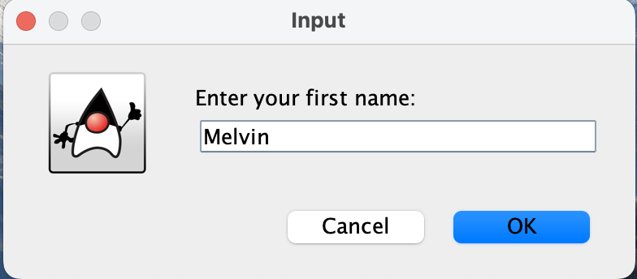
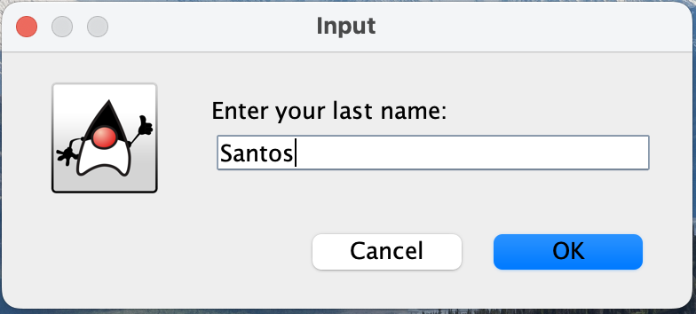
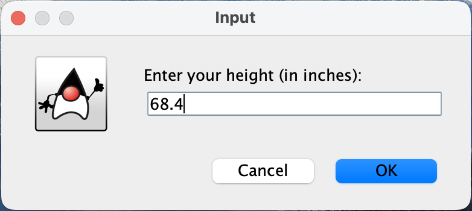
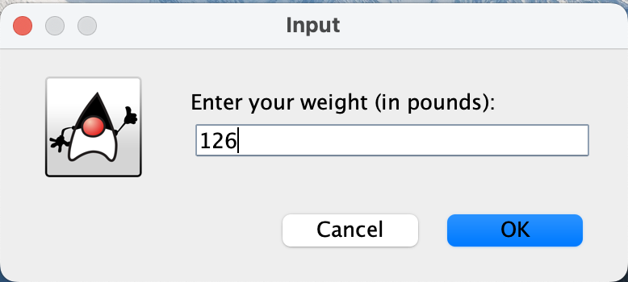
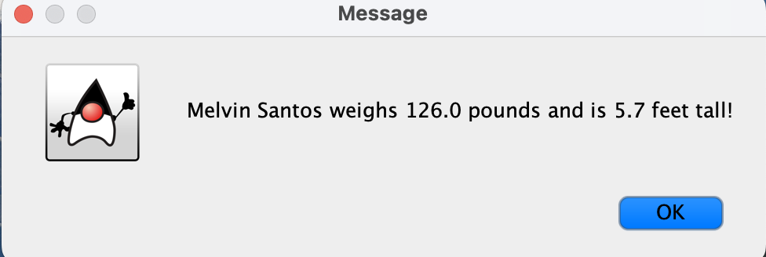
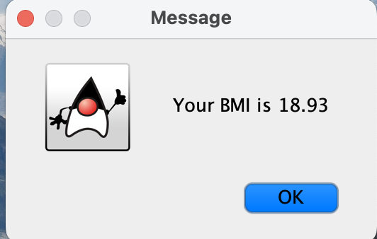
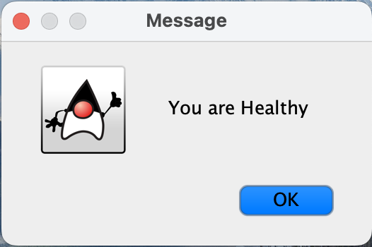

# BMI-Calculator
Simple Body Mass Index (BMI) Calculator

## Description
This program calculates a persons BMI by getting the height and weight. It will determine if the person is underweight, healthy, obese, or extremely obese. If the person is not, then it will give them the recommended weight.

## **Steps**
**Enter first name:**
 

 
**Enter last name:**
 

 
**Enter height in inches:**
 

 
**Enter weight in pounds:**
 

 
**Show person's info:**
 

 
**Show BMI**
 

 
**Show Health status**
 

 

